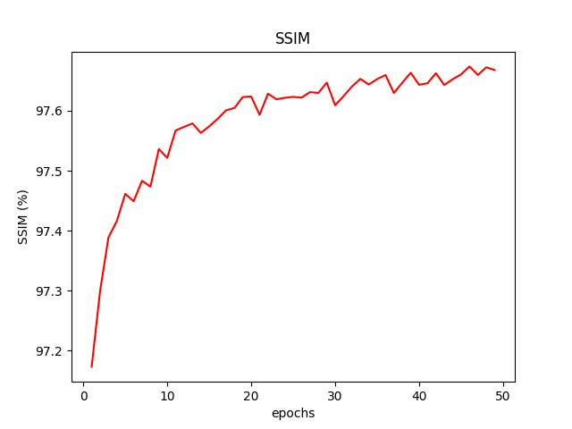

# DnCNN(2016)

DnCNN\([paper](https://arxiv.org/pdf/1608.0398.pdf)\)을 PyTorch로 구현합니다. 논문 리뷰 과정은 [gitbook](https://bengaleehs.gitbook.io/ai-paper-study/dncnn)에서 볼 수 있습니다.

  다음은 DnCNN-S(std=25)의 train 결과입니다.
BSD68로 test한 결과,
|Model|PSNR(dB)|
|---|---|
|DnCNN-S(25)|29.23|
|Ours(25)|28.90|

Set12로 Test한 결과,
|Criteria|Curve|
|---|---|
|MSE Loss|  |
|PSNR| |
|SSIM|   |

 

