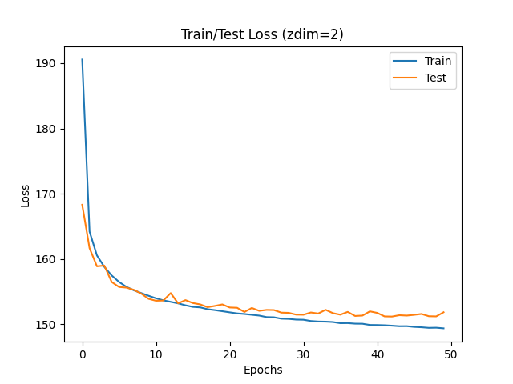

# VAE(2013)

Auto-Encoding Variational Bayes\([paper](https://arxiv.org/abs/1312.6114)\)의 내용을 이해하고 MNIST 예제를 PyTorch로 구현합니다. 논문 리뷰 과정은 [gitbook](https://bengaleehs.gitbook.io/ai-paper-study/vae)에서 볼 수 있습니다. 

_학습 그래프\(Z_DIM=2\)_   
