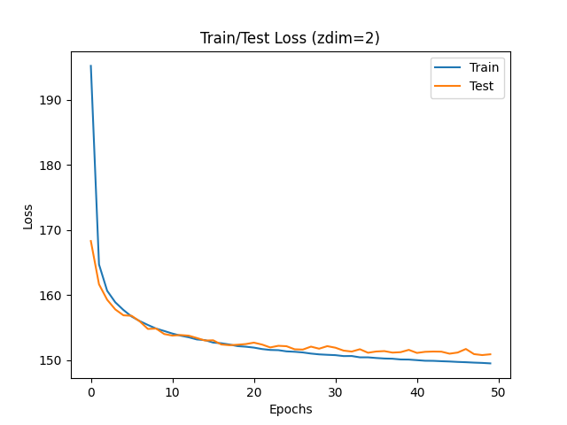
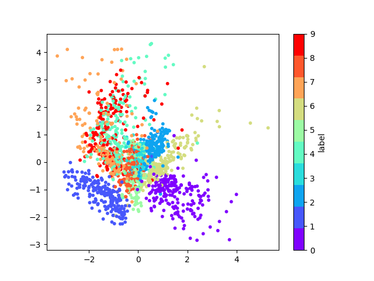
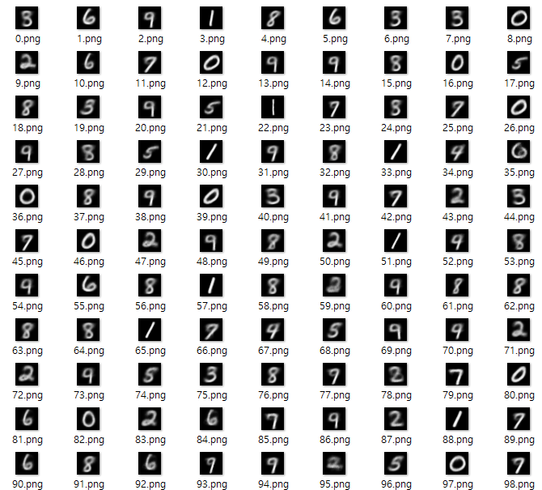
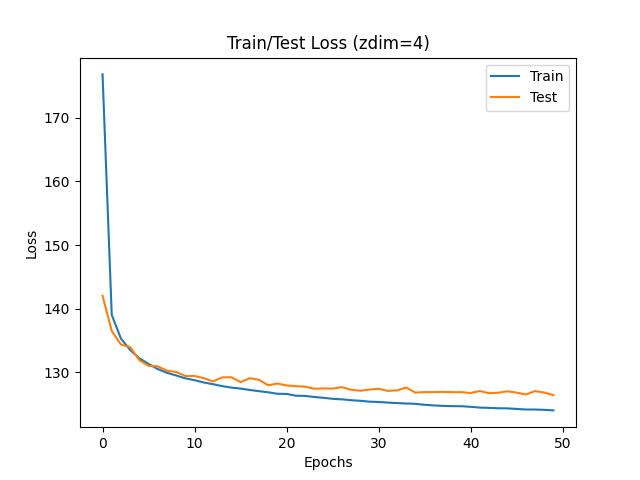
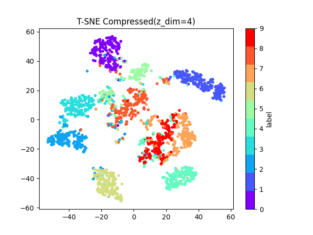
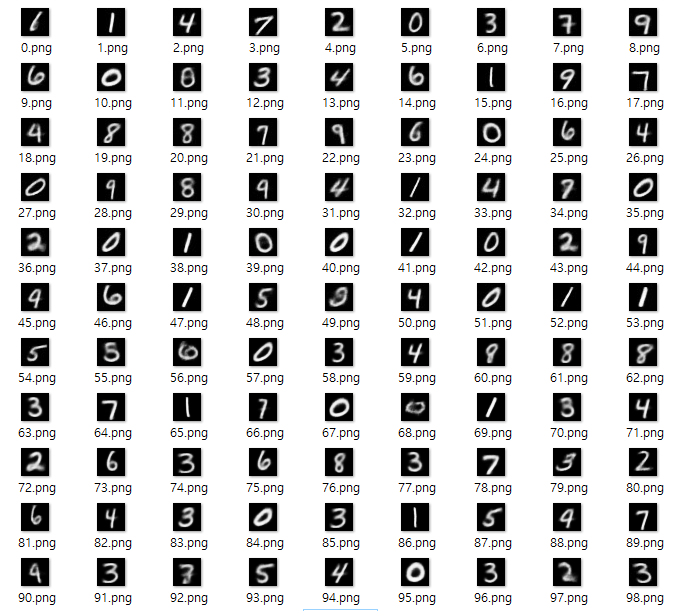

# VAE(2013)

Auto-Encoding Variational Bayes\([paper](https://arxiv.org/abs/1312.6114)\)의 내용을 이해하고 MNIST 예제를 PyTorch로 구현합니다.  논문 리뷰 과정은 [gitbook](https://bengaleehs.gitbook.io/ai-paper-study/vae)에서 볼 수 있습니다.
## Z_DIM=2
잠재변수 공간의 차원이 2인 경우의 결과 
  
_학습 그래프\(Z_DIM=2\)_     
  
_숫자에 해당하는 잠재변수_  
  
출력 결과는 위와 같고, 구분하기 어려운 숫자가 많다. 
## Z_DIM=4
잠재변수 공간의 차원이 4인 경우의 결과 
  
_학습 그래프\(Z_DIM=4\)_    
Z_DIM=2일때보다 Loss가 더 낮은 것을 알 수 있다. 
  
_숫자에 해당하는 잠재변수_  
  
차원이 높기에 T-SNE로 차원축소했다.  숫자가 비교적 잘 구분되며 모든 숫자가 존재한다. 
