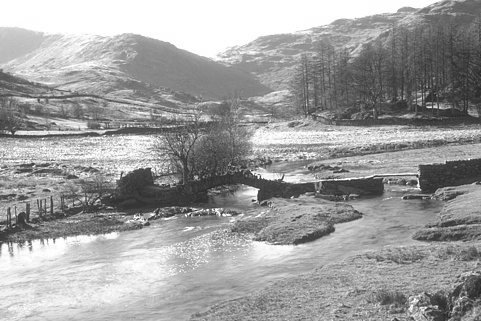

# Implemention - 구현

전체 코드와 결과는 [여기](https://github.com/BengaleeHS/practice-ai-paper/tree/main/DnCNN%282016%29)에 저장되어 있다.

## Model Formulation

### Architecture

```python
class DnCNN(nn.Module):
    def __init__(self,channel=1,depth=17):
        super(DnCNN,self).__init__()
        L=[]
        L.append(nn.Conv2d(channel,64,3,padding=1,bias=False))
        L.append(nn.ReLU(inplace=True))
        for i in range(depth-2):
            L.append(nn.Conv2d(64,64,3,padding=1,bias=False))
            L.append(nn.BatchNorm2d(64))
            L.append(nn.ReLU(inplace=True))
        L.append(nn.Conv2d(64,channel,3,padding=1,bias=False))
        self.seq = nn.Sequential(*L)

    def forward(self,x):
        return (self.seq(x))
```

d-2개의 Conv-BN-ReLU unit과 시작, 끝부분에 Conv를 두는 구조이다. forward는 noise를 deterministic하게 예측한다.

### Parameter Initialization

kaiming normal initialize한다. batch normalization의 초기화는 일반적인 normal dist로 초기화한다.

## Data Preparation

### crop

```python
def crop_mp(paths,l,size, stride,grayscale):
    patches = []
    for i, p in enumerate(paths):
        with Image.open(p) as im:
            left=0
            while left+size<im.width:
                upper = 0
                while upper+size<im.height:
                    cim = im.crop(box=(left,upper,left+size,upper+size))
                    cim = np.array(cim)
                    rot = np.random.randint(4)
                    flip = np.random.randint(2)
                    for _ in range(rot):
                        cim = np.rot90(cim)
                    if flip==1:
                        cim = np.fliplr(cim)
                    if(grayscale):
                        cim = np.array(Image.fromarray(cim).convert("L"))
                    patches.append(cim)
                    upper+=stride
                left+=stride
    l.extend(patches)

def prepare(path='',batch_size=128, batch_count=1600, size=40, stride=10, num_workers=4,grayscale=True):
    if num_workers > mp.cpu_count():
        return -1
    patches = []
    workers = []
    paths = glob.glob(path+'/*.png')
    paths.extend(glob.glob(path+'/*.jpg'))

    pool = mp.Pool(processes=num_workers)
    lt = pool.map(crop,paths)
    l = []
    for ll in lt:
        l.extend(ll)
    count = len(l)
    to_take = np.random.choice(count,batch_size*batch_count,replace = False)
    final = np.take(l, to_take, axis=0)
    return final
```

crop하되, 매우 많은 양이므로 multiprocessing한다. crop 후, rotation, flip을 랜덤하게 한 후 섞은 후 데이터 개수에 맞춰 선출한다.

### Dataset

```python
class TrainDataset(Dataset):
    def __init__(self,xs,noise_level) -> None:
        super(TrainDataset, self).__init__()

        self.isBlind = type(noise_level)==list
        self.sigma = noise_level

        self.xs = xs

    def __getitem__(self, index):
        t = transforms.ToTensor()(self.xs[index])
        if self.isBlind:
            x = t
            y = (t + torch.randn(t.shape)*np.random.randint(self.sigma[0],self.sigma[1])/255.0)
        else:
            x = t
            y = (t + torch.randn(t.shape)*self.sigma/255.0)
        return x, y
    
    def __len__(self):
        return len(self.xs)
```

noise를 추가한 뒤 clamp한다. x는 깨끗한 이미지, y는 noisy 이미지이다.

## Result

CImageNet400을 grayscale로 변환한 이미지를 crop해 Train data로 사용하고, BSD68을 Test data로 사용한다. Batch size는 128, 총 배치 수는 1600개이며 50 epoch 학습한다. Optimizer는 Adam이고 **learning rate를 1e-3으로 하되, 30epoch에서 1e-4로** 스케줄링한다.


Test Data에 대한 epoch에 따른 평균 PSNR의 곡선은 위와 같이 나타나며, 논문의 29.2까지 도달하지는 못했으나 29.02dB를 기록했다.

추가적으로, SSIM을 평가 지표로 사용했다.

복원된 이미지 예시이다. 




DnCNN의 출력 이미지를 보면, 분명 노이즈를 제거하나 이미지 본래의 자글자글한 부분까지 노이즈로 인식해 패턴을 없애버린다. 나무의 풀잎, 모래 부분을 보면 내부의 무늬가 감소함을 알 수 있다. MSE loss는 인간의 시각적 인식을 그대로 반영하지 않기 때문에, loss function에 SSIM 항을 추가하는 방법도 존재한다.

