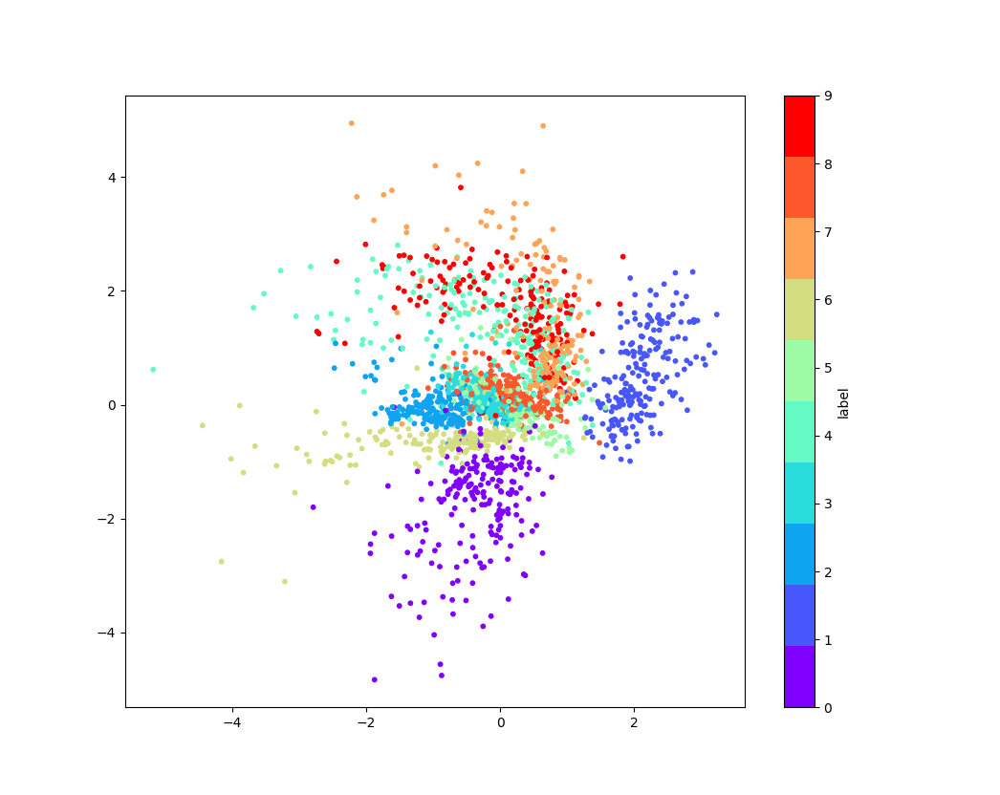
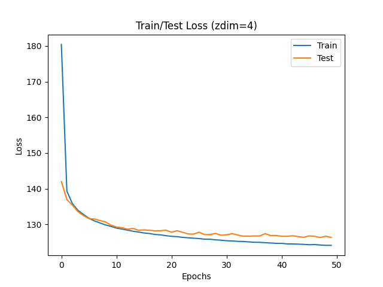
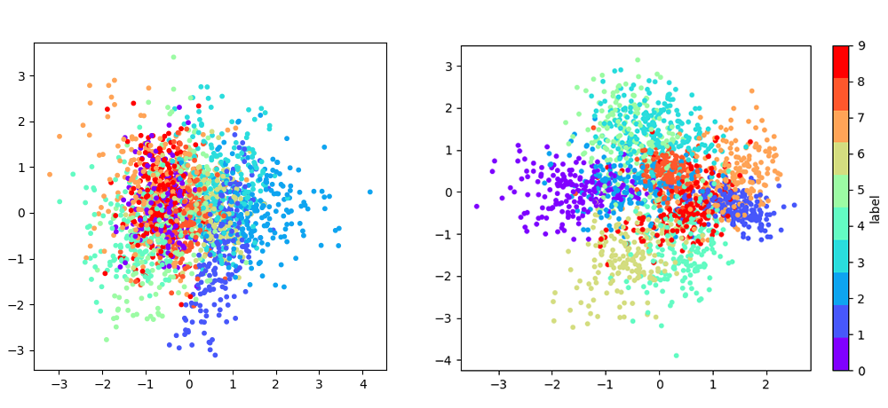

# Implementation - 구현

AEVB / SGVB를 적용한 Variational Autoencoder를 구현한다.

## Model

본래 VAE는 MLP로 구성되지만, 이 구현에선 컨볼루션 레이어를 사용한다. latent\_dim은 잠재변수 z의 차원이다. 2와 4에서 실험할 것이다.

### Encoder

| Layer | Params |
| :--- | :--- |
| Conv+ReLU | 1 -&gt; 32, size=3x3, stride=2, pad=1 |
| Conv+ReLU | 32 -&gt; 64, size=3x3, stride=2, pad=1 |
| Flatten |  |
| Linear\(mean\) | 3136 -&gt; latent\_dim |
| Linear\(logvar\) | 3136 -&gt; latent\_dim |

정규분포의 분산은 항상 양수인데, linear 레이어의 출력은 실수값이다. 실수 범위를 가지는 로그분산\( $$\log \sigma^2$$\)을 출력한 후 $$\sigma=\exp(\frac 1 2 \log\sigma^2)$$ 을계산한다. 정규분포를 가정한 네트워크이다.

### Sampling

`torch.randn_like` 로 epsilon 샘플 후, 이를 이용해 z를 계산한다.

### Decoder

베르누이 분포를 가정한다. 출력이 0과 1 사이의 픽셀값이다.

| Layer | Params |
| :--- | :--- |
| Linear+ReLU | latent\_dim -&gt; 3136 |
| Reshape | \(3136,\) -&gt; \(64,7,7\) |
| Deconv+ReLU | 64 -&gt; 64, size=3x3, stride=2 |
| Deconv+ReLU | 64 -&gt; 32, size=3x3, stride=2 |
| Conv | 32 -&gt; 1, size=4x4, stride=1 |

ConvTranspose2d로 차원\(28x28\)을 맟출 수 없었기에 최종적으로 Conv2d를 한번 더 해준다. 

모델 클래스의 코드는 다음과 같다.

```python
class ConvVAE(nn.Module):
    def __init__(self,latent_dim):
        super(ConvVAE,self).__init__()
        self.latent_dim=latent_dim
        
        self.conv1 = nn.Conv2d(1,32,3,2,1) #28->14 
        self.conv2 = nn.Conv2d(32,64,3,2,1) #14->7
        self.linear1mean = nn.Linear(7*7*64,latent_dim) #7*7*64 -> mu
        self.linear1logvar = nn.Linear(7*7*64,latent_dim) #7*7*64 -> logvar

        self.linear2 = nn.Linear(latent_dim, 7*7*64) #z -> 7*7*64
        self.deconv1 = nn.ConvTranspose2d(64,64,3,2) #7 -> 15
        self.deconv2 = nn.ConvTranspose2d(64,32,3,2) #31
        self.conv3 = nn.Conv2d(32,1,4,1) #31->28


    def encoder(self,x):
        x = F.relu(self.conv1(x))
        x = F.relu(self.conv2(x))
        x = x.view(-1,7*7*64)
        mean = self.linear1mean(x)
        logvar = self.linear1logvar(x)
        
        return mean, logvar
    
    def decoder(self,z):
        z = F.relu(self.linear2(z))
        z = z.view(-1,64,7,7)
        z = F.relu(self.deconv1(z))
        z = F.relu(self.deconv2(z))
        z = F.sigmoid(self.conv3(z))
        
        return z

    def sample(self,mean,logvar):
        #epsilon ~ N(O,I)
        eps = torch.randn_like(mean) .to('cuda')
        return mean+torch.exp(0.5*logvar)*eps
    
    def forward(self,x):
        mean,logvar = self.encoder(x)
        z = self.sample(mean,logvar)
        xhat = self.decoder(z)
        return xhat,mean,logvar
```

## Train 

### Prepare

Hyperparameter, 데이터셋, 모델, optimizer를 다음과 같이 로드한다.

| Param | Value |
| :--- | :--- |
| Batch Size | 100 |
| Epochs | 50 |
| Optimizer / lr | Adam / 0.001 |
| Z의 차원 | 2 또는 4 |

```python
BATCH_SIZE=100
EPOCHS=50
Z_DIM = 2

transform = transforms.Compose([transforms.ToTensor()])
train_dataset= datasets.MNIST('./',train=True,transform=transform,download=True)
test_dataset = datasets.MNIST('./',train=False,transform=transform)

train_loader = torch.utils.data.DataLoader(train_dataset,batch_size=BATCH_SIZE,shuffle=True,pin_memory=True)
test_loader = torch.utils.data.DataLoader(test_dataset,batch_size=BATCH_SIZE,shuffle=False,pin_memory=True)

model = ConvVAE(Z_DIM)
optim = torch.optim.Adam(model.parameters(),lr=1e-3)
```

### Loss Function

Loss는 다음과 같이 정의한다.  미니배치의 크기가 100으로 충분히 크므로 L을 1로 해도 무관하다. 다음을 배치 하나 속의 데이터 포인트 100개에 대해 평균낸다\(Monte Carlo Estimation\).

$$
-\tilde \mathcal L^M(\theta,\phi;\bold x^{(i)})=-\frac 1 2\sum^J_{j=1}\left(1 +\log((\sigma_j^{(i)})^2)  -(\mu_j^{(i)})^2-(\sigma_j^{(i)})^2   \right)-\log p_{\bm \theta}(\bold x^{(i)}|\bold z^{(i,l)})
$$

$$-\log p_{\bm \theta}(\bold x^{(i)}|\bold z^{(i,l)})$$ 는 Negative Log Likelihood이므로 크로스 엔트로피로 계산할 수 있고, 생성된 x에 대한 분포함수이다. z로부터 생성된 x가 데이터셋의 x일 확률을 계산한다. 디코더의 출력층에 이미 sigmoid를 적용해 확률값 0~1로 출력되므로, PyTorch에서 사용할 수 있는 loss는 BCELoss이다.

코드로 나타내면

```python
def lossfunc(mean,logvar,x,xhat):
    BCE = torch.mean(torch.sum(F.binary_cross_entropy(xhat,x,reduction='none'),(1,2,3)))
    KLD = torch.mean(-0.5*torch.sum(1+logvar-mean.pow(2)-logvar.exp(),1),0)
    return BCE+KLD
```

Reduction은 과정에 오류가 없도록 수동으로 해주었다.

### Iteration

Train 과정의 코드는 기존것과 크게 다르지 않다.

```python
def train(epoch, model, optim, loader):
    losses = 0
    model.train()
    for idx, (x,_) in enumerate(loader):
        x = x.to(DEVICE)
        optim.zero_grad()
        xhat, mean,logvar = model(x)
        loss = lossfunc(mean,logvar,x,xhat)
        loss.backward()
        optim.step()

        losses+= loss.item()
        if idx%200 ==0:
            print(f'{100.*idx/len(loader):.1f}%, loss={loss.item():.2f}')
    return losses/len(loader)

def test(epoch, model, loader):
    losses = 0
    model.eval()
    for idx, (x,_) in enumerate(loader):
        x = x.to(DEVICE)
        xhat, mean,logvar = model(x)
        with torch.no_grad():
            loss = lossfunc(mean,logvar,x,xhat)
            losses+= loss.item()
    return losses/len(loader)

train_losses = []
test_losses = []
model.to(DEVICE)

for epoch in range(1,EPOCHS+1):
    train_loss = train(epoch,model,optim,train_loader)
    print(f'EPOCH {epoch}, train_loss={train_loss:.2f}',end='')
    train_losses.append(train_loss)

    test_loss = test(epoch,model,test_loader)
    print(f', test_loss={test_loss:.2f}\n')
    test_losses.append(test_loss)

    if epoch%10 ==0:
        torch.save(model.state_dict(),f'./checkpoint2/check{epoch}.pt')

print(train_losses)
print(test_losses)
```

## Result

학습 후, 잠재 변수와 MNIST 숫자 레이블이 잠재변수 공간 어디에 위치하는지 시각화했다. 학습이 잘 되었다면 올바르게 클러스터링되어야 한다.

### Z\_DIM=2

잠재변수가 두 개의 실수일 때 결과이다.


과적합 이전에 적절히 멈추었다.

시각화 결과,



점이 0 주변에 올바르게 분포해 했으나, 일부 숫자는 잘 분리되지 않았다.

100개를 Train Data에서 뽑아 적절히 생성했다. 결과, 다음과 같은 숫자가 생성되었다.


생성된 숫자가 애매하게 보이는 것이 많고, 압축  및 복원 과정에서 어려움이 있었다.

### Z\_DIM=4

잠재 변수가 4개의 실수일 때 결과이다.



Z\_DIM=2에서보다 더 낮은  Loss를 보였다!



4차원이므로 시각화가 까다롭다. 따라서 두 plot으로 나누었다. 차원이 높으므로 조금 더 분리될 가능성이 높을 것이다.

생성된 이미지들은 실제로 더 또렷한 숫자들로 보였으며, 0부터 9까지 각각 또렷하게 보이는 숫자들이 적어도 하나씩 존재했다. 더 잘 최적화되었다.


