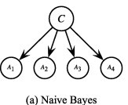

# Introduction

## 베이지안 모델

Introduction을 살펴보기 전, 베이지안 모델이 무엇인지 알아보자. **베이즈 추론은 어떠한 관측이 있을 때, 사건이 일어날 확률\(조건부확률\)을 기반으로 한다.** 베이즈 정리는 다음과 같다. 분류 클래스 C와 관측값 X가 있을 때를 예로 들면

$$
P(C|X)=\frac{P(X|C)P(C)}{P(X)}
$$

이다. 분자는 결합확률 $$P(X,C)$$이다. $$P(C|X)$$를 사후확률\(posterior\),  $$P(C)$$를 사전확률\(prior\), $$P(X|C)$$를 가능도\(likelihood\), $$P(X)$$를 관측값\(evidence\)으로 부른다.

나이브 베이즈 분류\([wiki](https://ko.wikipedia.org/wiki/%EB%82%98%EC%9D%B4%EB%B8%8C_%EB%B2%A0%EC%9D%B4%EC%A6%88_%EB%B6%84%EB%A5%98)\)를 생각하면, 어떤 클래스가 주어졌을 때 관측값 X의 각각의 n개의 특성들은 조건부 독립이므로, 

$$
P(X,C)=P(C)\prod^n_{i=1}P(X_i|C)
$$

로 표현되어 posterior을 구할 수 있다. 이렇게 조건부 독립을 사용한 확률 모델을 베이지안 모델이라고 부르며 VAE와 같은 생성 모델도 이와 같은 베이지안 모델이다. 

나이브 베이즈 분류기의  확률 모델을 그래프로 나타내면 다음과 같은 유향 비순환 그래프\(DAG\)로 나타내어진다. 각 노드는 확률변수를 의미하고, 각 엣지는 두 확률변수 사이의 확률적 관계를 나타낸다.

위의 확률 모델의 결합확률을 구해보면 다음과 같이 나타내어진다\(확률값 하나가 아닌 분포이므로 \).

$$
p(C,A_1,A_2,A_3,A_4)=p(C)p(A_1|C)p(A_2|C)p(A_3|C)p(A_4|C)
$$

로지스틱 회귀와 같은 판별 모델은 확률분포 $$p(C|X)$$를 직접 학습해 출력하도록 하는 반면, 생성 모델은 샘플을 생성할 수 있도록 likelihood$$p(X|C)$$와 prior $$p(C)$$를 학습함으로써 posterior $$p(C|X)$$를 간접적으로 학습한다. 나이브 베이즈의 경우, 확률변수 C를 샘플링한 뒤, $$p(A_1|C), ..., p(A_4|C)$$확률을 이용해  $$A_1$$부터 $$A_4$$까지 샘플링한다면, 새로운 샘플을 생성할 수 있다. 이것이 **Ancestral\(Forward\) Sampling**이다. 즉, 나이브 베이즈는 생성 모델이다. 


[DnCNN\(2016\)](../../dncnn/)는 이미지를 생성하는데도 discriminative model로 설명한다. 왜냐하면 model이 데이터셋\(=노이즈가 있는 이미지\)을 생성하지 않기 때문이다. DnCNN은 데이터셋에 대한 분포인 noisy image에 대한 분포는 고려하지 않으며, 대신 **세상에 있는 모든 이미지의 사전지식\(prior\) 확률분포를 모델에 학습**시켜 노이즈만 남도록 이미지를 제거한다.

반면, 나이브 베이즈의 확률 분포를 이용하면 분류시킬 수 있는 진짜같은 데이터 샘플을 하나 만들 수 있다!


## Intractable posterior


Intractable은 문제를 해결하는 효율적인 알고리즘이 존재하지 않는 경우를 지칭한다. 시간복잡도가 지수증가인 경우가 있다.


Abstract에 나타난 첫 번째 목표에 해당한다.

posterior\(사후확률\)분포를 학습하는 것이 확률 모델\(directed로 한정한다 - 방향성이 있음\)을 사용해 예측하고 샘플을 생성하는 데 매우 중요하다. 그런데 이 **posterior가 매우 복잡한 분포를 가지고 있어서** 최적화하기 어렵다면 어떡할까?

Variational Bayesian 방법은 계산하기 어려운 분포를 근사해 다룰 수 있도록 만들어 준다. 복잡한 posterior 분포를 학습하기 위해 전통적으로 사용되었던 variational bayesian 접근법인 mean-field 근사는 posterior에 대한 해석적인 해를 필요로 하므로, 일반적으로 사용할 수 없는 방법이었다. 

이를 해결하기 위해 이 논문에선, variational lower bound를 reparameterize함으로써, 연속적 잠재 변수를 가지는 어느 모델에 대해서나 적용할 수 있는, SGD로 최적화 가능한 방법\(SGVB\)을 설명한다.

## Large Dataset

Abstract에 나타난 두 번째 목표에 해당한다.

IID\(서로 독립이고 모두 같은 분포를 가지는 확률변수들\)인 데이터셋과 각 데이터 하나하나에 대해 잠재 변수가 있는 경우에 대해 Auto-Encoding Variational Bayes\(AEVB\) 방법을 논문에서 제안한다. AEVB는 SGD로 최적화 가능한 Variational Bayes\(SGVB\) 추정량\(모델 파라미터의 추정 방법이라고 생각하자\)을 사용함으로써 학습이 용이하고 ancestral sampling을 통해 새로운 샘플을 생성하는 추론도 효율적으로 할 수 있다. 


위에서 보았듯, Ancestral Sampling이란 유향 비순환 그래프\(DAG\)로 나타내어지는 베이지안 네트워크에서 확률변수를 순서대로 샘플링해 새로운 샘플을 생성하는 과정이다.


본래라면 MCMC\(Markov Chain Monte Carlo\) Sampling이라는 cost가 높은 방법을 사용해 샘플링을 했지만, 새로운 방법을 사용해 더욱 효율적으로 샘플링할 수 있다.

## Variational Auto-Encoder

VAE는 

* 복잡한 분포를 가진 posterior을 근사하고, lower bound를 올려 최적화하기 위해 Gradient descent를 사용할 수 있도록 만들었다\(Variational\).
* 이를 학습시키기 위해, encoder-decoder 를 사용하는 Auto-Encoder와 유사한 구조를 가진다.
* 결국 연속 잠재 변수가 존재하면서, 다루기 힘든 posterior가 있을 때도 효율적으로 최적화\(GD\)/추론\(Ancestral Sampling\)할 수 있다.

