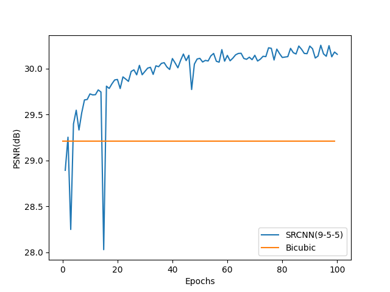

# Implementation - 구현

전체 코드와 결과는 [여기](https://github.com/BengaleeHS/practice-ai-paper/tree/main/SRCNN\(2015\))에 저장되어 있다.

## Model

```python
class SRCNN(nn.Module):
    def __init__(self,f1=9,f2=5,f3=5,n1=64,n2=32):
        super(SRCNN,self).__init__()
        self.conv1 = nn.Conv2d(3,n1,f1,padding=f1//2)
        self.conv2 = nn.Conv2d(n1,n2,f2,padding=f2//2)
        self.conv3 = nn.Conv2d(n2,3,f3,bias=False,padding=f3//2)

    def forward(self,x):
        x = F.relu(self.conv1(x))
        x = F.relu(self.conv2(x))
        x = self.conv3(x)
        return x
```

간단한 Model이므로 forward propagation을 쉽게 구현할 수 있다.

## Dataset

```python
#학습 데이터셋
class TrainDataset(Dataset):
    def __init__(self,path):
        self.paths = glob.glob(path)
        self.trans = transforms.Compose([transforms.Resize((11,11)),
                            transforms.Resize((33,33), interpolation=InterpolationMode.BICUBIC),
                            transforms.ToTensor()])

    def __getitem__(self, index):
        x = Image.open(self.paths[index])
        y = Image.open(self.paths[index])
        x = self.trans(x)
        y = transforms.ToTensor()(y)
        return x,y

    def __len__(self):
        return len(self.paths)

#테스트 데이터셋
class TestDataset(Dataset):
    def __init__(self,path):
        self.paths = glob.glob(path)

    def __getitem__(self, index):
        x = Image.open(self.paths[index])
        y = Image.open(self.paths[index])
        w = x.width//3 *3
        h = x.height//3 *3

        x = x.resize([w//3,h//3],resample=Image.BICUBIC)
        x = x.resize([w,h],resample=Image.BICUBIC)
        x = transforms.ToTensor()(x)
        y = transforms.ToTensor()(y.resize([w,h],resample=Image.BICUBIC))
        return x,y

    def __len__(self):
        return len(self.paths)
```

Train Dataset은 미리 crop해둔 이미지를 불러와, Resize한다.

Test Dataset은 Set5 Dataset을 한 장씩 불러와, Scale Factor=3으로 Resize 가능하도록 이미지를 조정한다.

## Result

**9-5-5, n1=64, n2=32**의 SRCNN (3배율)으로 91 Images에서 **batch size=16으로 100회** 학습했다.

첫 두 layer는 $$10^{-4}$$, 마지막 layer는 $$10^{-5}$$의 learning rate로 학습하며, 논문과는 다르게 **Adam Optimizer**를 사용한다.

**RGB 3 channel**에서 모두 학습해 parameter의 수는 약 20000개이다.

Set5의 이미지 중 하나를 실행해 보았다. Bicubic에 비해 다른 부분 사이의 경계가 더욱 sharp해진 것을 확인할 수 있다. 원본 논문에서도, Edge detection에 해당하는 filter가 나타났다고 한다.


.png>)

MSE loss와 PSNR은 구현 결과다음과 같이 보여진다. Bicubic(29.21 dB)보다 높은 PSNR을 보인다. 최고 PSNR은 **30.25 dB**이다.

.png>)


