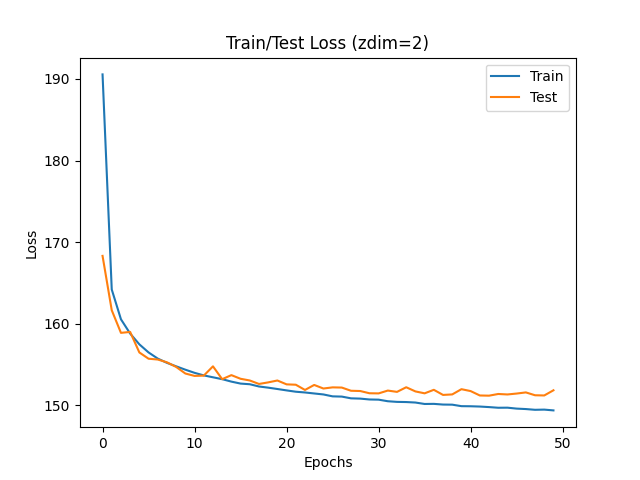
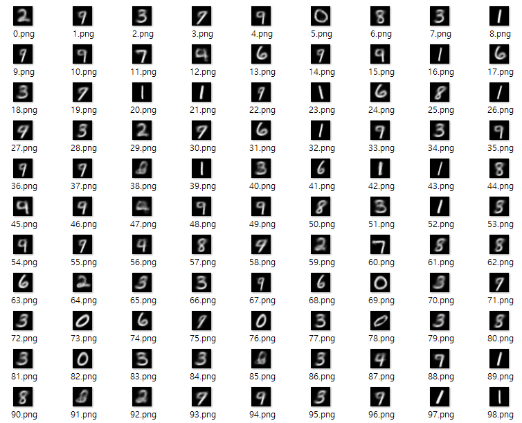

# VAE\(2013\)

Auto-Encoding Variational Bayes\([paper](https://arxiv.org/abs/1312.6114)\)의 내용을 이해하고 MNIST 예제를 PyTorch로 구현합니다.   
논문 리뷰 과정은 [gitbook](https://bengaleehs.gitbook.io/ai-paper-study/vae)에서 볼 수 있습니다.

## Z\_DIM=2

잠재변수 공간의 차원이 2인 경우의 결과  
   
  
 _학습 그래프\(Z\_DIM=2\)_   
  
   
  
 _숫자에 해당하는 잠재변수_  
  
   
  
 출력 결과는 위와 같고, 구분하기 어려운 숫자가 많다.  

## Z\_DIM=4

잠재변수 공간의 차원이 4인 경우의 결과  
   
  
 _학습 그래프\(Z\_DIM=4\)_   
 Z_DIM=2일때보다 Loss가 더 낮은 것을 알 수 있다._  
 __  
  
 __숫자에 해당하는 잠재변수\_  
  
   
  
 숫자가 비교적 잘 구분되며 모든 숫자가 존재한다.  

